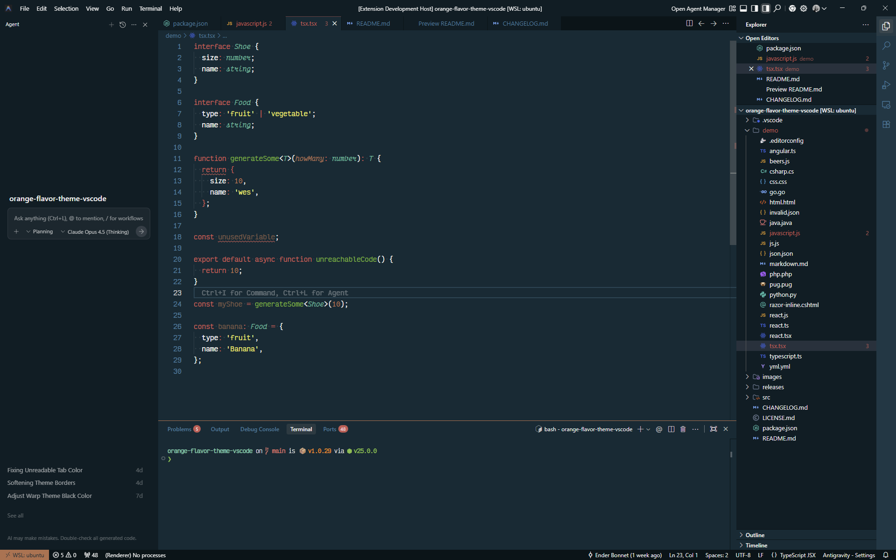
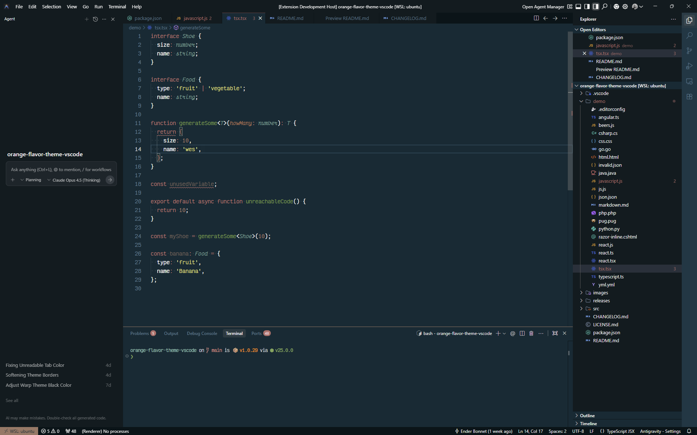

<div align="center">
<h1>TanStack Theme for Visual Studio Code</h1>

[](https://marketplace.visualstudio.com/items?itemName=enbonnet.tanstack-theme)
[](https://marketplace.visualstudio.com/items?itemName=enbonnet.tanstack-theme)
[](https://opensource.org/licenses/MIT)


</div>

## 📋 Table of Contents

- [✨ Features](#-features)
- [🎨 Preview](#preview)
- [🚀 Installation](#-installation)
- [🎨 Using the Theme](#-using-the-theme)
- [🎨 Color Palette](#-color-palette)
- [🤝 Contributing](#-contributing)
- [📄 License](#-license)
- [💖 Credits](#-credits)

## ✨ Features

- 🌙 Dark theme optimized for long coding sessions
- 🎨 Carefully selected color palette for better code readability
- 💻 Support for popular programming languages and file types
- 🖌️ Custom UI theming for a cohesive VS Code experience
- 🎯 Designed specifically for TanStack developers

## 🎨 Preview

### Base Theme
<div align="center">

</div>

### Soft Variant
<div align="center">

</div>

## 🚀 Installation

### VS Code Marketplace
[](https://marketplace.visualstudio.com/items?itemName=enbonnet.tanstack-theme)

### Open VSX Registry
[](https://open-vsx.org/extension/enBonnet/tanstack-theme)

## 🎨 Using the Theme

1. Open the Command Palette (`Ctrl+Shift+P` or `Cmd+Shift+P`)
2. Type "Preferences: Color Theme" and press Enter
3. Search for "TanStack Theme"
4. Select either "TanStack Theme" or "TanStack Theme (Soft)" from the list

### Recommended Settings

For the best experience, add these to your `settings.json`:

```json
{
  "workbench.colorTheme": "TanStack Theme",
  "editor.fontFamily": "'Fira Code', 'Dank Mono', 'JetBrains Mono', Consolas, 'Courier New', monospace",
  "editor.fontLigatures": true,
  "editor.cursorBlinking": "smooth",
}
```

## 🎨 Color Palette

## Color Palette

This theme uses a tropical-inspired color palette derived from the TanStack brand:

| Role | Color | Hex | Preview |
|------|-------|-----|---------|
| Background | Deep Ocean | `#0F2A35` |  |
| Foreground | White | `#F3F3F3` |  |
| Selection | Ocean Highlight | `#1E4555` |  |
| Comments | Deep Teal | `#3B7E9F` |  |
| Cyan | Teal | `#50B195` |  |
| Green | Grassy Green | `#6AAB2E` |  |
| Orange | Coral | `#F68453` |  |
| Pink/Red | Red | `#D05952` |  |
| Purple | Brown/Orange | `#BA704B` |  |
| Yellow | Lime | `#E7E659` |  |

### UI Variants

| Variable | Hex | Purpose |
|----------|-----|---------|
| BGDarker | `#061419` | Deepest background |
| BGDark | `#0A1D25` | Dark panels/sidebars |
| BG | `#0F2A35` | Main editor background |
| BGLight | `#163845` | Lighter panels |
| BGLighter | `#1E4555` | Hover states/highlights |

## 🤝 Contributing

Contributions are welcome! If you find any issues or have suggestions for improvements, please feel free to:

1. Open an [issue](https://github.com/enbonnet/tanstack-theme-vscode/issues)
2. Submit a pull request
3. Share your feedback

## 📄 License

This project is licensed under the MIT License - see the [LICENSE](LICENSE) file for details.

## 💖 Credits

- Inspired by the beautiful TanStack brand colors and design
- Special thanks to the VS Code community for their amazing theming support
- Thanks to all contributors who help improve this theme

## 📬 Stay Updated

For updates, star this repository and follow me on [GitHub](https://github.com/enbonnet).

### From VS Code Marketplace

1. Open **Extensions** sidebar in VS Code (`Ctrl+Shift+X` / `Cmd+Shift+X`)
2. Search for `TanStack Theme`
3. Click **Install**
4. Select the theme: `Ctrl+K Ctrl+T` → Choose **TanStack Theme** or **TanStack Theme Soft**

### Manual Installation

1. Download the `.vsix` file from [Releases](https://github.com/enBonnet/tanstack-theme-vscode/releases)
2. Run `code --install-extension tanstack-theme-x.x.x.vsix`

## Variants

- **TanStack Theme** - Standard version with vibrant colors
- **TanStack Theme Soft** - Softer, desaturated version for reduced eye strain

## Development

### Prerequisites

- [Node.js](https://nodejs.org/) (v18+)
- [pnpm](https://pnpm.io/) or npm

### Setup

```bash
# Install dependencies
pnpm install

# Build the theme
pnpm run build

# Package the extension
pnpm run package
```

### Project Structure

```
├── src/
│   └── tanstack.yml      # Theme source file (YAML)
├── theme/
│   ├── tanstack.json     # Generated theme
│   └── tanstack-soft.json
├── scripts/
│   ├── build.js          # Build script
│   └── generate.js       # Theme generator
└── images/
    └── icon.png          # Extension icon
```

## Inspiration

This theme is based on the [Dracula Theme](https://draculatheme.com/) schema, with colors adapted from the TanStack brand palette featuring tropical/beach aesthetics.

## License

[MIT License](LICENSE)

---

Made with 🌴 by [Ender Bonnet](https://github.com/enBonnet)
